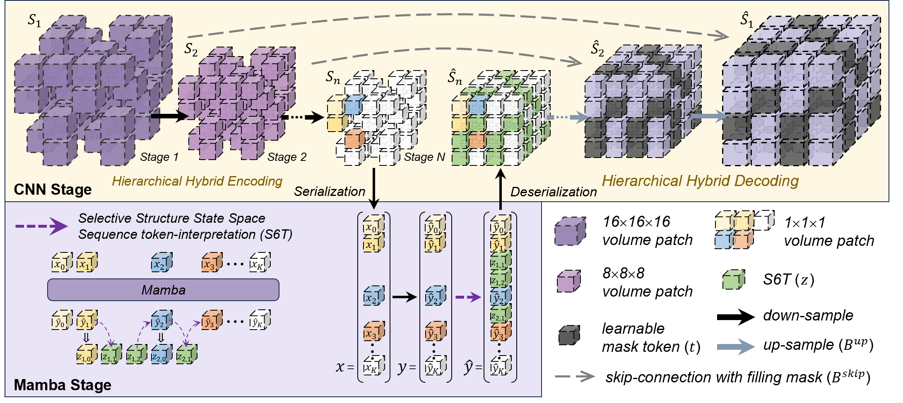

## MambaMIM: Pre-training Mamba with State Space Token-interpolation

<p align="center" width="100%">
<!---->
</p> 




<div align="center">
    <span class="author-block">
    <a href="https://scholar.google.com/citations?user=x1pODsMAAAAJ&hl=en" target="_blank">Fenghe Tang</a><sup>1,2</sup>,</span>
    <span class="author-block">
    <a target="_blank">Bingkun Nian</a><sup>3</sup>,</span>
    <span class="author-block">
    <a target="_blank">Yingtai Li</a><sup>1,2</sup>,</span>
    <span class="author-block">
    <a href="https://scholar.google.com/citations?user=tmx7tu8AAAAJ&hl=en" target="_blank">Jie Yang</a><sup>3</sup>,</span>
    <span class="author-block">
    <a href="https://scholar.google.com/citations?user=Vbb5EGIAAAAJ&hl=en" target="_blank"> Liu Wei</a><sup>3</sup>,</span>
    <span class="author-block">
    <a href="https://scholar.google.com/citations?user=8eNm2GMAAAAJ&hl=en" target="_blank">S.Kevin Zhou</a><sup>1,2</sup>
    </span>
</div>

<br>

<div align="center">
    <sup>1</sup>
    <a href='https://en.ustc.edu.cn/' target='_blank'>School of Biomedical Engineering, University of Science and Technology of China</a>&emsp;
    <br>
    <sup>2</sup> <a href='http://english.ict.cas.cn/' target='_blank'>Suzhou Institute for Advanced Research, University of Science and Technology of China</a>&emsp;
    <br>
    <sup>3</sup> <a href='http://www.pami.sjtu.edu.cn/En/Home' target='_blank'>Department of Automation, Institute of Image Processing and Pattern Recognition, Shanghai Jiao Tong University</a>
    <br>
</div>

<br>
<br>

​                                                                              [](https://arxiv.org/pdf/2408.08070.pdf)   [](https://github.com/FengheTan9/MambaMIM)    <a href="#LICENSE--citation"></a>


## News

- **[2024/08/16] Pre-train Weights will be released soon !** 😘
- **[2024/08/16] Paper and code released !**


## TODOs

- [x] Paper released 
- [x] Code released
- [ ] Weight released


## Getting Started


### Prepare Environment

```
conda create -n mambamim python=3.9
conda activate mambamim
pip install torch==1.13.0 torchvision==0.14.0 torchaudio==0.13.0 --extra-index-url https://download.pytorch.org/whl/cu117
pip install packaging timm==0.5.4
pip install transformers==4.34.1 typed-argument-parser
pip install numpy==1.21.2 opencv-python==4.5.5.64 opencv-python-headless==4.5.5.64
pip install 'monai[all]'
pip install monai==1.2.0
pip install causal_conv1d-1.2.0.post2+cu118torch1.13cxx11abiTRUE-cp38-cp38-linux_x86_64.whl
pip install mamba_ssm-1.2.0.post1+cu118torch1.13cxx11abiFALSE-cp38-cp38-linux_x86_64.whl
```


### Prepare Datasets

We recommend you to convert the dataset into the  [nnUNet](https://github.com/MIC-DKFZ/nnUNet/blob/master/documentation/dataset_format.md) format.

```
└── MambaMIM
    ├── data
        ├── Dataset060_TotalSegmentator
            └── imagesTr
                ├── xxx_0000.nii.gz
                ├── ...
        ├── Dataset006_FLARE2022
            └── imagesTr
                ├── xxx_0000.nii.gz
                ├── ...
        └── Other_dataset
            └── imagesTr
                ├── xxx_0000.nii.gz
                ├── ...
```


A example ```dataset.json``` will be generated in ```./data```

The content should be like below

```json
{
    "training": [
        {
            "image": "./Dataset060_TotalSegmentator/imagesTr/xxx_0000.nii.gz"
        },
        {
            "image": "./Dataset006_FLARE2022/imagesTr/xxx_0000.nii.gz"
        },
    ]
}

```


## Start Training

Run training on multi-GPU :

```sh
# An example of training on 4 GPUs with DDP
torchrun --nproc_per_node=4 --nnodes=1 --node_rank=0 --master_addr=localhost --master_port=12351 main.py --exp_name=debug --data_path=./data  --model=mambamim --bs=12  --exp_dir=debug_mambamim_ddp_4
```

Run training on the single-GPU :

```sh
# An example of training on the single GPU
python main.py --exp_name=debug --data_path=./data --model=mambamim --bs=4 --exp_dir=debug_mambamim
```


## Fine-tuning

Load pre-training weights :

```python
# An example of Fine-tuning on BTCV (num_classes=14)
from models.network.hymamba import build_hybird

model = build_hybird(in_channel=1, n_classes=14, img_size=96).cuda()

model_dict = torch.load("./[your_ckpt_path]/hybird_ct_pretrained_timm_style_mask75.pth")   

if model.load_state_dict(model_dict, strict=False):
    print("MambaMIM use pretrained weights successfully !")
```

Downstream pipeline can be refered to [UNETR]([research-contributions/UNETR/BTCV at main · Project-MONAI/research-contributions (github.com)](https://github.com/Project-MONAI/research-contributions/tree/main/UNETR/BTCV))


## Acknowledgements:

This code-base uses helper functions from [SparK](https://github.com/keyu-tian/SparK).


## Citation

If the code, paper and weights help your research, please cite:

```

```


## License

This project is released under the Apache 2.0 license. Please see the [LICENSE](LICENSE) file for more information.
